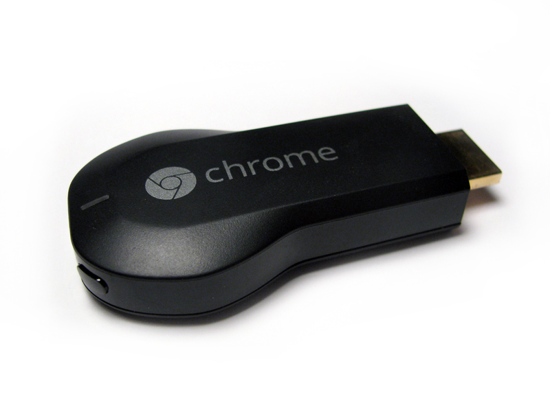
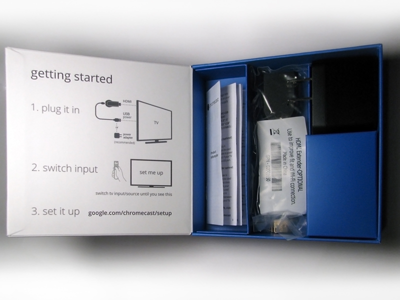
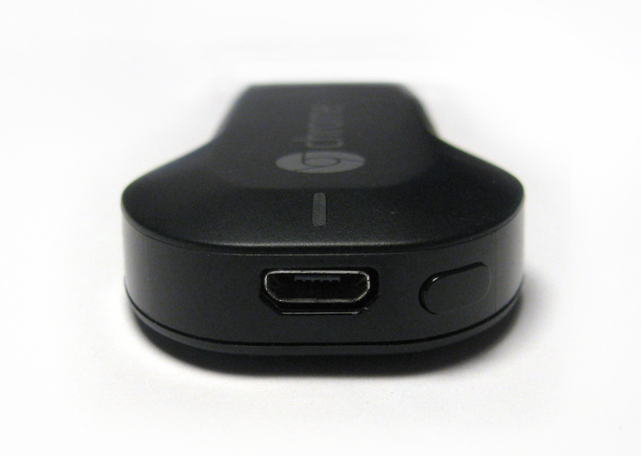

I was lucky enough for my birthday this year to receive a brand new Chromecast from a friend. I had been wanting once since they were announced, and after seeing the price tag ($35) I wanted one even more. So what are my impressions from about 2 months worth of time with it? Read on for my thoughts below.

## Initial Impressions

The Chromecast comes in a small package with everything you need. There's the device itself, as well as the usual manual a USB cable, and a power adapter. The packaging is pretty slick. Very clean and Apple like, though it's about what I'd expect from a company like Google. One of the things that stuck me first was just how small the Chromecast was. It's not much bigger than a typical USB flash drive. Of course, you could almost confuse it for one since there is only 1 obvious port that looks very USB-like, the HDMI port. On the opposite end of the device is the USB port.

## Installation

Installation of the Chromecast was fairly straight forward, but I did run into a few surprising challenges. It should be as simple as the packaging stated: Plugin, switch to input, set up with an App or Chrome extension. For me most of this went well and as expected. Getting the app for my various Android devices was no issue at all, same with the extension for the Chrome web browser. The problem for me was getting my equipment to get a display out of the thing.

Initially, I figured two things:

- I could just plug it into my home theater receiver and it would display just the same
- I could use a spare USB port for power

At first, I set it up like that. After quite a few minutes between a friend and I of tinkering, we still had not gotten a signal from the input. We tried switching the input, not using USB power, a reset of the receiver, nothing seemed to do it. I'm not sure what finally changed the Chromecast's mind, but when we plugged it directly into an HDMI port and USB port on my LG television, it sprang to life... after some more unplugging and re-plugging in.

## Set Up

After this initial headache, set up was very easy. Almost too easy. Follow the on screen instructions to link up your device to the Chromecast, and give the Chromecast the credentials to your network via the extension / app. I did the whole thing via my Android tablet and we were up and ready to go within just a few minutes. After getting it to work, it had no complaints moving back to my receiver with a USB power source. An odd hiccup, but easily remedied.

I thought at first that there would be more to actually, you know... set up. Maybe configure all sorts of options and things of the Chromecast. Unfortunately (or fortunately, depending on your viewpoint) there really isn't a lot to configure besides network settings and a few odds and ends. There isn't anything substantial, and I'm hoping more advanced settings are added (which I'll go over later).

## Casting

What surprised me about the Chromecast was that it has no apps. What I mean by that is you don't install apps on the Chromecast, which is what I expected. Instead, you use Android apps that are compatible (or Chrome on your computer) to send a signal to it. So, many of the apps you'll probably want to use with the Chromecast, you may already have. Open a compatible app and a cast icon is available. Tap the cast button and your content shoots over to the screen. It really is as simple as that.

Our TV is a newer one, and it came with YouTube, Netflix, and Plex pre-installed as apps. All of those apps are available for Android and compatible with the Chromecast. While my TV's interface for Netflix and Plex hasn't really ever bothered me, they've always been a little sluggish. The YouTube app on it is pretty much unusable. Its cumbersome and terribly slow.

Being that the TV is so bad with YouTube, playing those videos via Chromecast is much easier. I usually find the video I want on my tablet, tap the cast button, and after buffering its playing on the TV. No headache, no slow interface. The nicest part is being able to search and queue up more videos for casting while you wait. Obviously this has made YouTube parties at my place super easy. Pretty much pass around the tablet and watch. 

All of the other apps are just as simple to use, but don't have the same intuitive feature as the queue. For instance, the Google Music app doesn't seem to be friendly to that very same idea of queuing. Maybe I missed something. I hope I did, because being able to DJ via your phone or tablet is always a nice ability for parties, but not when you're always looking at it. The app I was really hoping to test, Plex, currently only offers casting to MyPlex subscribers. Fortunately, the feature is eventually slated to come to non-subscribers, at which point I'll probably use the app on my tablet more than on my TV as with YouTube.

## Umm... apps please?

Unfortunately, this brings me to the biggest downside of the Chromecast right now. There aren't really any apps. I mentioned Netflix, Plex, Google Music, and YouTube. In addition, there are about 10 others. Yes, the current crop of apps for Chromecast stands at less than two dozen. This is mainly due to the fact that Google hasn't really opened up the SDK for the Chromecast yet, so only a handful of developers have the ability to add the capability to their apps at the moment. Google is supposedly releasing said SDK later this year. At that point, we'll probably see many more apps for Chromecast pop up. Music, video, and movie / tv apps are obvious, but it's possible that later we may get games (use the device as a controller while the actual game world is on screen? Hey, its an idea!)

## Final Thoughts

Outside of the current apps, there really isn't anything to do with it. If you have a smart TV with a decent interface, you may not even use it. Before my (accidental) YouTube party, I actually hadn't used it since Christmas (where it played [The Nerdist Yule Log](https://www.youtube.com/watch?v=Fo1YG_kdpxQ) on repeat for a party). Fortunately for Google, no TV manufacturer has really been able to nail down a great and responsive UI for their apps (at least not that I've seen). So, if you really hate bad interfaces, it may be worth it. Pair it with your iOS or Android device and get the benefit of using an interface you already know that probably works much better. A scenario that is _really_ worth it though, is if you have a "dumb" TV but one that still is up to date enough to have HDMI. Essentially, you can upgrade your TV to now have apps very easily. However, there are similar products that are around the same price that have been out (Roku, anyone?) that already have a more robust library of apps and community built around them.

Hopefully later this year, the release of the developer tools will cause many more apps to show up. The usual stuff like MLBTV, Vimeo, Spotify, etc. will probably show up very quickly. I'm also interested on the possibilities of what the average developer can do, but that's a ways off. For now, I'll probably continue to use it only once and awhile. Hopefully before my next impromptu YouTube party.

### UPDATE 2/3/2014

So, the SDK was recently opened up! We'll see how many developers start working on app compatibility for the Chromecast now.
